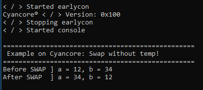

# cc-swap-no-temp
A project based on cyancore software framework

To run this example, follow the below commands
```
$ git clone https://github.com/VisorFolks/cyancore.git               # Clone cyancore repo
$ vi mk/tc_get.mk       # Updated toolchain
$ cd src/projects
$ git clone https://github.com/akashkollipara/cc-swap-no-temp.git   # Clone this repo
$ cd ../../
$ make get_avr_tc       # Use correct command for fetching toolchain, this is just for illustration purpose
$ make cc-swap-no-temp # build will be located at out/cc-swap-no-temp
```

Flash the binary on target using respective programmer.

Below is the demo running on atmega328p (Arduino Uno)


